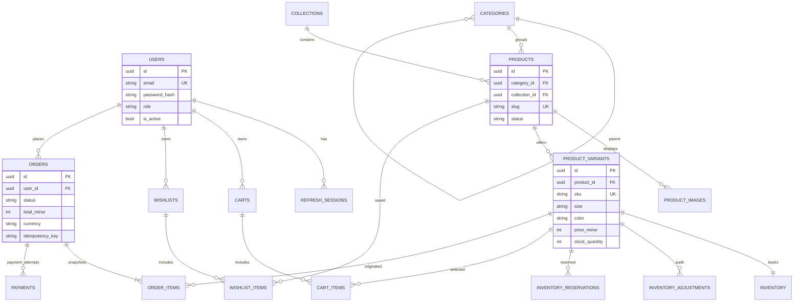

# Database ERD

```mermaid
erDiagram
  USERS ||--o{ REFRESH_SESSIONS : has
  USERS ||--o{ CARTS : owns
  USERS ||--o{ WISHLISTS : owns
  USERS ||--o{ ORDERS : places
  CATEGORIES ||--o{ CATEGORIES : parent
  CATEGORIES ||--o{ PRODUCTS : groups
  COLLECTIONS ||--o{ PRODUCTS : contains
  PRODUCTS ||--o{ PRODUCT_IMAGES : displays
  PRODUCTS ||--o{ PRODUCT_VARIANTS : offers
  PRODUCT_VARIANTS ||--|| INVENTORY : tracks
  PRODUCT_VARIANTS ||--o{ INVENTORY_ADJUSTMENTS : audit
  PRODUCT_VARIANTS ||--o{ INVENTORY_RESERVATIONS : reserved
  CARTS ||--o{ CART_ITEMS : includes
  PRODUCT_VARIANTS ||--o{ CART_ITEMS : selected
  WISHLISTS ||--o{ WISHLIST_ITEMS : includes
  PRODUCTS ||--o{ WISHLIST_ITEMS : saved
  ORDERS ||--|{ ORDER_ITEMS : snapshots
  PRODUCT_VARIANTS ||--o{ ORDER_ITEMS : originated
  ORDERS ||--o{ PAYMENTS : payment_attempts
  USERS {
    uuid id PK
    string email UK
    string password_hash
    string role
    bool is_active
  }
  PRODUCTS {
    uuid id PK
    uuid category_id FK
    uuid collection_id FK
    string slug UK
    string status
  }
  PRODUCT_VARIANTS {
    uuid id PK
    uuid product_id FK
    string sku UK
    string size
    string color
    int price_minor
    int stock_quantity
  }
  ORDERS {
    uuid id PK
    uuid user_id FK
    string status
    int total_minor
    string currency
    string idempotency_key
  }
```

The diagram is a target model; implementation/migration status is tracked in `docs/project-status.md` and `docs/milestones.md`.
